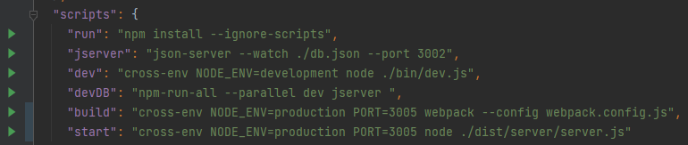

Для запуска проекта в режиме разработки выполните команду

`npm run devDB`

Если возникли проблемы с командой(долгая сборка)
выполните команды

`npm run dev`

`npm run jserver`

в разных окнах

Также вы можете посмотреть приложение **без json-server** на heroku по ссылке:
**https://contacts-book.herokuapp.com/**
ке: https://contacts-book.herokuapp.com/
